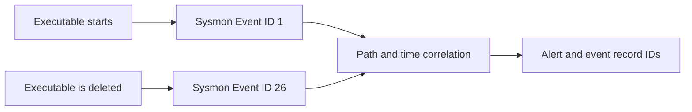

# T1070.004 File Deletion Detection for Windows


A focused DFIR lab and PowerShell proof of concept for detecting an executable
that is deleted shortly after it runs. The detector correlates Sysmon
`ProcessCreate` (Event ID 1) and `FileDeleteDetected` (Event ID 26) events by
full path and time window, then returns the event record IDs needed for further
investigation.

> **Published research:** This repository accompanies my Xakep.ru article
> [Эхо пустоты. Как из Windows вытаскивают следы удаленных файлов](https://xakep.ru/2026/08/28/windows-forensic-recovery/)
> (*Echo of the Void: Recovering Traces of Deleted Files in Windows*), selected
> as an Editor's Choice. The article is written in Russian.

## At a glance

| Item | Value |
| --- | --- |
| ATT&CK technique | [T1070.004 — File Deletion](https://attack.mitre.org/techniques/T1070/004/) |
| Platform | Windows 10/11 |
| Telemetry | Sysmon Event ID 1 and Event ID 26 |
| Detector | PowerShell; read-only event-log analysis |
| Correlation key | `ProcessCreate.Image == FileDeleteDetected.TargetFilename` |
| Default window | 15-minute lookback; deletion within 10 minutes of execution |
| Scope | Targeted laboratory proof of concept |

## Why this lab exists

Deleting a payload, script, or temporary tool after execution can reduce the
obvious evidence left on disk. A deletion event alone, however, is not proof of
malicious activity. This lab adds context by asking a narrower question:

> Was the same executable observed running shortly before it was deleted?

The article examines the forensic traces that can remain after deletion,
Recycle Bin cleanup, and reboot. This repository isolates the live-telemetry
correlation used to identify the execute-to-delete sequence.

## How it works



The PowerShell detector:

1. Reads recent Event IDs 1 and 26 from the Sysmon Operational log.
2. Parses their XML event data into named fields.
3. Filters both event sets using the configured target pattern.
4. Compares the process image path with the deleted file path
   case-insensitively.
5. Verifies that deletion occurred after execution and inside the configured
   time window.
6. Returns timestamps, process context, and both Sysmon record IDs.

The core condition is:

```text
ProcessCreate.Image == FileDeleteDetected.TargetFilename
AND 0 <= (DeletedAt - ExecutedAt) <= MaxDeltaMinutes
```

## Repository structure

```text
.
├── detection/
│   ├── Detect-T1070_004.ps1  # Event correlation and alert output
│   └── sysmon-t1070.xml      # Minimal lab telemetry configuration
└── README.md
```

## Requirements

- Windows 10 or Windows 11
- [Sysmon](https://learn.microsoft.com/en-us/sysinternals/downloads/sysmon)
- Windows PowerShell 5.1 or PowerShell 7+
- An elevated PowerShell session for Sysmon setup and reliable log access
- A benign test executable in an isolated lab or virtual machine

No malware or test executable is included in this repository.

## Quick start

### 1. Clone the repository

```powershell
git clone https://github.com/Debusterlil/T1070.004-File-Deletion-Detection.git
Set-Location .\T1070.004-File-Deletion-Detection
```

### 2. Apply the Sysmon configuration

> [!WARNING]
> Applying a Sysmon configuration replaces the active configuration. The
> included XML is intentionally narrow and intended for an isolated lab. Do not
> apply it unchanged to a production endpoint; merge the two rules into your
> existing configuration instead.

For a new Sysmon installation:

```powershell
& 'C:\Tools\Sysmon\Sysmon64.exe' -accepteula -i `
    "$PWD\detection\sysmon-t1070.xml"
```

If Sysmon is already installed:

```powershell
& 'C:\Tools\Sysmon\Sysmon64.exe' -c `
    "$PWD\detection\sysmon-t1070.xml"
```

Adjust the path to `Sysmon64.exe` for your environment.

### 3. Generate benign lab events

The supplied rules target `T1070_004_Test.exe`. In an isolated VM:

1. Place a benign executable with that name on the test system.
2. Run it once.
3. Delete it within 10 minutes.

To use another filename, change the target in both places before applying the
configuration:

- `$TargetPattern` in `detection/Detect-T1070_004.ps1`
- The `Image` and `TargetFilename` rules in `detection/sysmon-t1070.xml`

### 4. Run the detector

```powershell
.\detection\Detect-T1070_004.ps1
```

Representative alert excerpt:

```text
[ALERT] Executed file deleted shortly after launch

Executable          : C:\Users\dfirlab\Desktop\T1070_004_Test.exe
DeltaSeconds        : 42.999
ProcessCreateRecord : 356
FileDeleteRecord    : 360
```

The full result also reports `ExecutedAt`, `DeletedAt`, `LaunchParent`, and
`DeletedBy`.

## Configuration

The detector exposes three values at the top of the script:

| Variable | Default | Purpose |
| --- | ---: | --- |
| `$TargetPattern` | `*\T1070_004_Test.exe` | Filename or path pattern to examine |
| `$LookbackMinutes` | `15` | How far back to query the Sysmon log |
| `$MaxDeltaMinutes` | `10` | Maximum allowed interval between execution and deletion |

## Investigative output

| Field | Investigative value |
| --- | --- |
| `Executable` | Full path shared by the execution and deletion events |
| `ExecutedAt` / `DeletedAt` | Timeline anchors for the observed sequence |
| `DeltaSeconds` | Time between process creation and file deletion |
| `LaunchParent` | Parent process that launched the executable |
| `DeletedBy` | Process recorded by Sysmon as performing the deletion |
| `ProcessCreateRecord` / `FileDeleteRecord` | Direct pivots to the source events in Event Viewer or PowerShell |

## Limitations

- This is a retrospective, target-specific lab detector, not a real-time
  monitor or a drop-in SIEM/EDR rule.
- Correlation is based on full path and timing, not on a shared process GUID or
  cryptographic identity.
- Repeated executions of the same path inside the time window can produce more
  than one candidate correlation.
- Legitimate installers, updaters, and temporary-file workflows can exhibit the
  same behavior; an alert requires analyst validation.
- Event ID 26 must have been enabled before deletion. It records the deletion
  event but does not preserve a copy of the deleted file.
- Production use should add environment-specific exclusions and enrich the
  signal with hashes, signer information, process lineage, user context, and
  other endpoint telemetry.

## References

- [MITRE ATT&CK T1070.004 — File Deletion](https://attack.mitre.org/techniques/T1070/004/)
- [Microsoft Sysinternals: Sysmon](https://learn.microsoft.com/en-us/sysinternals/downloads/sysmon)
- [Эхо пустоты. Как из Windows вытаскивают следы удаленных файлов](https://xakep.ru/2026/08/28/windows-forensic-recovery/)

## Author

**Vitalii ([@Debusterlil](https://github.com/Debusterlil))**

Independent DFIR researcher focused on Windows forensics, threat detection,
malware analysis, and reverse engineering.
